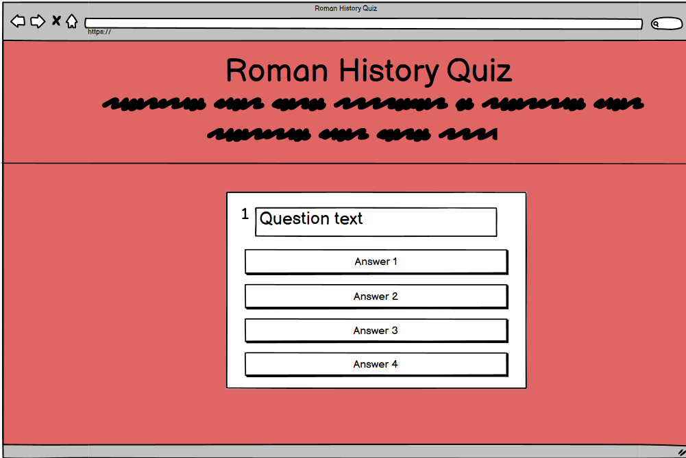
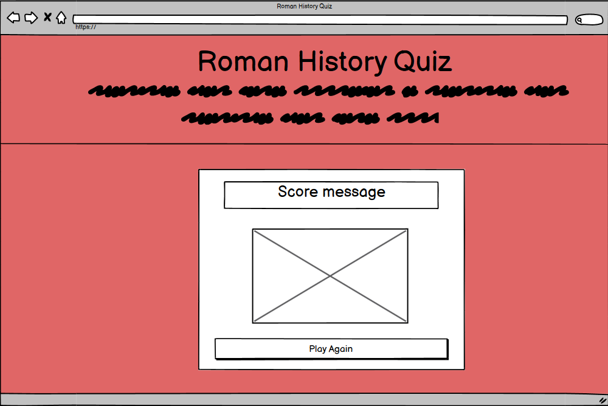
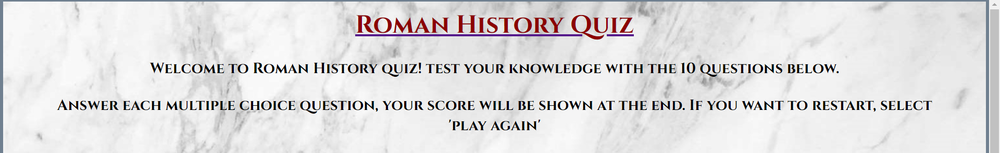
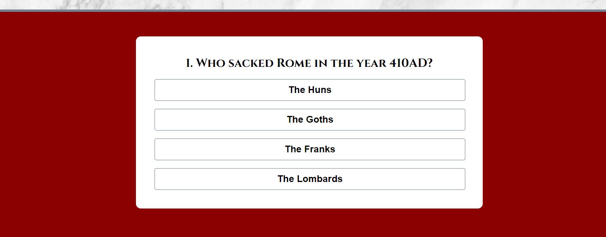
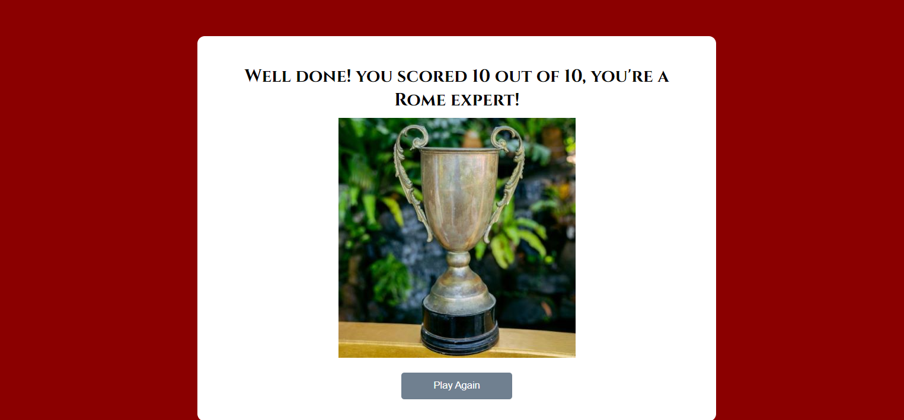
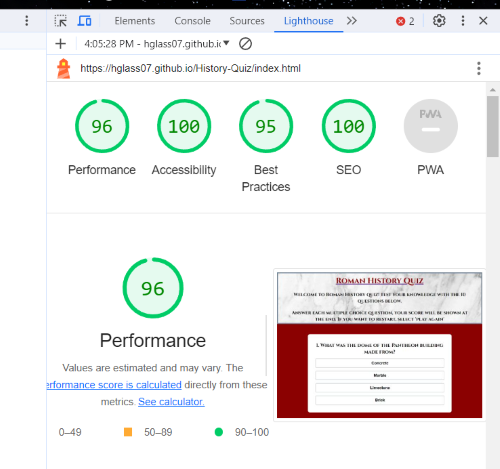
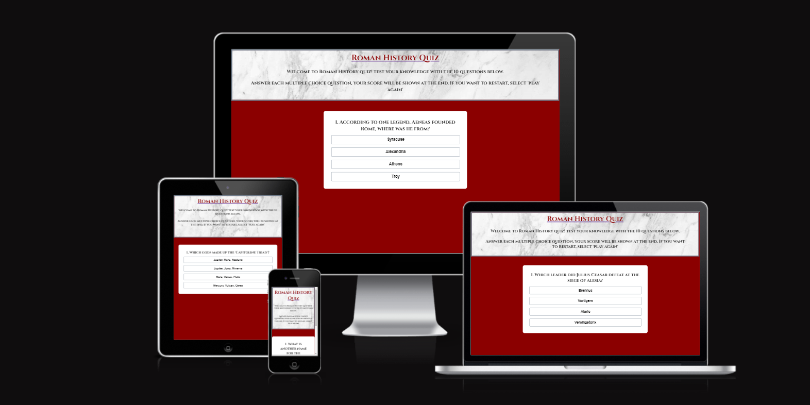
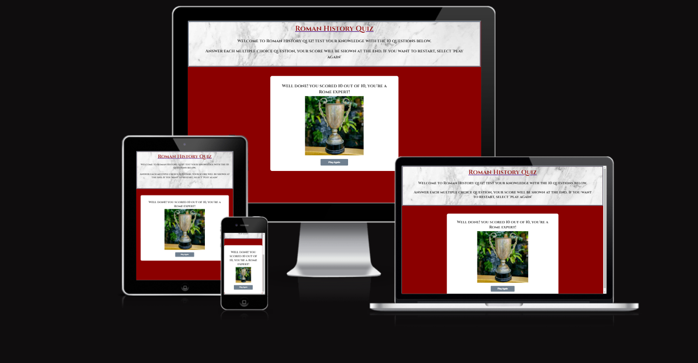

# Roman History Quiz
## Contents:
1. Description
2. Design
3. Features
4. Testing
5. Deployment
6. Credits

--------------

[Site Link](https://hglass07.github.io/History-Quiz/)

## Description:

Roman History Quiz is a quiz app that allows users to test their knowledge of ancient Roman history with a series of 10 questions. It is intended for anyone who wants to learn more about Roman history, or test their existing knowledge. The questions are surfaced in a random order from a selection of 15 possible questions - this ensures that the user can replay the quiz and be offered different questions each time. 

Once the quiz has finished, the user will be displayed with a different message depending on their score, with a 'reward' image being displayed to those who score 10/10. The user can then choose to play again to try and increase their score, or to see a different variety of questions.

**Site-owner Goals:**
- Provide a challenging knowledge test of the subject matter for users
- Allow users to easily understand the rules and expected output of the quiz
- Allow easy navigation of the site
- Ensure a degree of 're-playability' by making each play-through unique, and providing a different end result depending on score

# User-stories:

**First-time user:**
- As a first time user, I want to be presented with a site layout where it is immediately clear what the site's purpose is
- I want to be presented with a quiz whose content is engaging and challenging, and where there is a potential for learning new information
- I want to be able to see immediate feedback on my answers, with a visual cue informing if my answer was correct or not, as well as total score displayed at the end

**Returning user:**
- As a returning user, I want my experience of the quiz to be different to the first time
- I want to be able to use information I have gained from previous playthroughs to increase my score and alter the quiz outcome

--------------

## Design: 

The design of the website clearly lays out the description and instructions of the quiz in the header section, with the main quiz area below. Thematic colors and graphics are used to enhance the feel of the quiz, whilst not distracting the user. The questions are numbered from 1 to 10, with the 4 answer options being displayed in clear boxes below.

<wireframes>
  
<i>Wireframes - made using Balsamiq</i>

  
  
</wireframes>

--------------
## Features:

- Quiz instruction and description section.
  
  
- Main quiz area displaying question and multiple answers.
  
  
- Score section displayed after the quiz is complete, with score-dependent message to user, as well as a 'play again' function.
- 

--------------
## Testing:

The site was tested with an initial deployment. The quiz worked as intended, however some areas for improvement were identified such as:
- Questions moving on too quickly following user selection
- Users had no way of knowing if their answers were correct
  
These issues were subsequently fixed with a timer function, and color coding for correct and incorrect answers.

The site was tested on the following browsers, all site functions work as intended:
- Google Chrome
- Mozilla Firefox
- Safari
- Microsoft Edge

**Bugs identified:**
- Occasionally for iPhone users, it appears that once a question is answered and the next question is displayed, an answer will be highlighed as if it had been clicked on without any action from the user. This does not appear to be an issue for Android users. This bug does not 'break' the game, as the highlighted answer on the next question does not correspond with the correct answer, instead seeming to 'echo' the position of the previously clicked answer.

**Validation:**
- W3C HTML validation - no errors are returned when passing the HTML pages through this validator

- W3C CSS validator - no errors are returned when passing the CSS document through this validator

- JSHint Javascript validator - no errors are returned when passing the JS document through this validator

- Lighthouse - a lighthouse score was generated for the site, the results of which can be found below.

- Am I Responsive and Responsinator - using these websites it was possible to determine what the site would look like on different devices. All pages displayed as intended with the appropriate responsiveness.

 

--------------
## Deployment:

This project was deployed with the 'pages' function of github, using the steps below:

1. Access the appropriate repository on github
2. Go to the 'settings' panel and select the 'pages' tab
3. Ensure the project is deployed from the correct source by selecting 'main branch' in the branch menu.
4. Save changes
5. Return to the 'code' panel, and refresh the repository once the build has finished.
6. The deployed version of the site is now accessible from the right hand menu

--------------
## Credits:

Images:
The images used were taken from pexels:
- Marble surface, Henry and co.
- Close up shot of a trophy, Anna Tarazevich

Favicon:
- Emoji Favicons > Classical Building, Favicon.io 

Javascript:
- Fisher-Yates sorting algorithm  - Free Code Camp - https://www.freecodecamp.org/news/how-to-shuffle-an-array-of-items-using-javascript-or-typescript/
- Question display and answer functions - Greatstack - https://www.buymeacoffee.com/easytutorials

--------------
## Aknowledgements:

I would like to thank my tutor Antonio for his guidance in this project, as well as my friends and family for helping to test the app.
